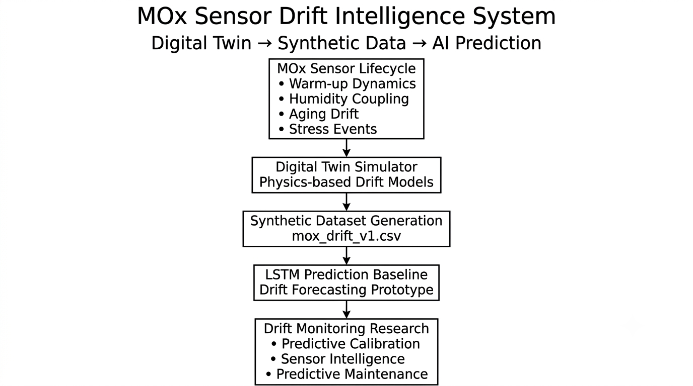
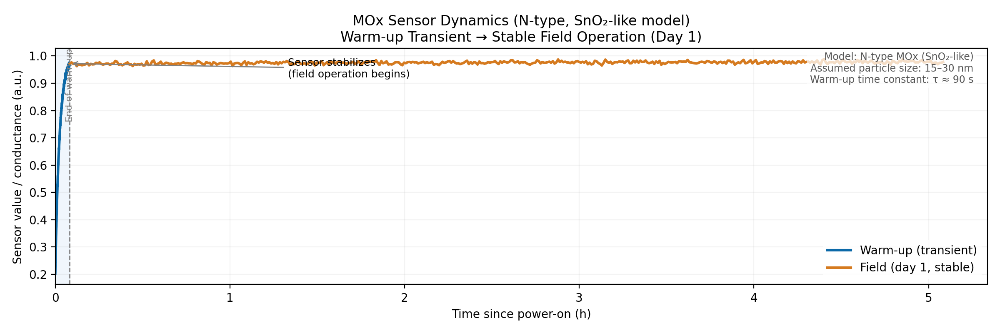
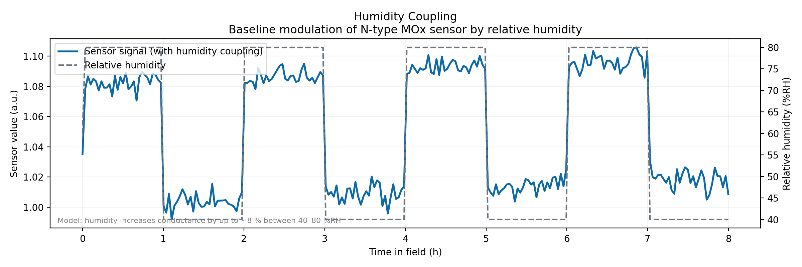
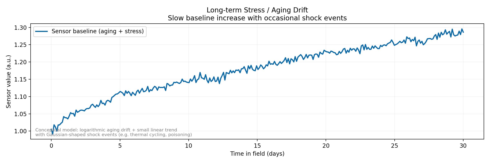

# MOx Sensor Drift Intelligence System

**Physics-based Digital Twin for MOx Sensor Lifecycle Simulation, Synthetic Data Generation, and AI-based Drift Prediction**

---

## Quick Summary

Metal oxide (MOx) gas sensors drift over time. Baseline resistance shifts due to humidity coupling, thermal cycling, aging, and episodic stress events. In deployed gas detection systems — industrial safety monitors, HVAC controllers, combustion analyzers, and environmental monitoring platforms — this drift degrades measurement reliability and increases calibration requirements.

This project implements a lightweight Digital Twin framework for MOx sensor lifecycle simulation. The simulator reproduces key drift mechanisms and generates synthetic datasets for AI model development, drift prediction research, and calibration strategy exploration.

**Core idea:** simulate drift physics first, then train AI models on synthetic lifecycle data — rather than waiting months for real sensor degradation datasets to accumulate.

---

## Industrial Motivation

Real-world MOx sensor drift datasets are expensive and time-consuming to collect. Meaningful drift behaviour often emerges only after weeks or months of operation under varying environmental conditions. This creates a practical challenge:

> AI-based drift prediction and calibration algorithms require large quantities of lifecycle data long before sufficient field data becomes available.

Digital Twin technology offers an alternative approach. By modeling known sensor degradation mechanisms in software, realistic synthetic datasets can be generated on demand, enabling early-stage development of:

- Drift prediction models
- Calibration strategies
- Sensor health monitoring concepts
- Predictive maintenance workflows

The goal of this project is not to reproduce a specific commercial sensor, but to provide a configurable framework for studying drift-aware AI workflows in gas sensing systems.

---

## What This Project Demonstrates

**Digital Twin Design for Sensor Systems**

The simulator encodes known MOx drift mechanisms:

- Humidity-coupled baseline shift
- Warm-up transient behavior
- Long-term aging drift
- Stress-induced baseline changes
- Thermal response effects

Each mechanism is independently configurable and reproducible.

**Structured Sensor Lifecycle Modeling**

A deployed MOx sensor experiences multiple operational phases:

- Power-on warm-up
- Normal field operation
- Calibration windows
- Stress exposure events

The simulator explicitly models these lifecycle stages instead of treating sensor output as a single homogeneous time series.

**Synthetic Data Generation as an Engineering Strategy**

Real drift datasets may require months of field operation. Synthetic generation decouples AI development from hardware availability and enables rapid experimentation with:

- Drift detection
- Predictive calibration
- Lifecycle analytics
- Sensor intelligence concepts

---

## System Architecture



The project follows a **Digital Twin → Synthetic Data → AI** workflow.

A physics-based simulator generates synthetic lifecycle data, which is then used to develop and evaluate drift prediction models.

---

## Example Results

### Warm-up Dynamics



The sensor transitions from a cold-start state toward a stable operating baseline through an exponential warm-up process before entering normal field operation.

### Humidity Coupling



Daily humidity variations induce measurable baseline shifts, illustrating environmental cross-sensitivity commonly observed in MOx gas sensors. The model applies a linear coupling coefficient that increases conductance by up to ~8% between 40–80 %RH, consistent with water vapour adsorption effects on the oxide surface.

### Stress-Induced Drift



Stress events introduce step-like baseline changes that accumulate over time, generating characteristic long-term drift behaviour. The conceptual model combines logarithmic aging drift with a small linear trend and Gaussian-shaped shock events representing sources such as thermal cycling or chemical poisoning.

---

## Simulated Drift Mechanisms

| Mechanism | Physical Basis | Implementation |
|---|---|---|
| Warm-up transient | Heater equilibration, oxide surface activation | First-order exponential approach to stable baseline |
| Humidity coupling | Water vapour adsorption shifts surface conductance | Linear coupling coefficient `k_h × (RH − RH_ref)` |
| Long-term aging | Grain boundary coarsening, dopant redistribution | Slow positive baseline drift |
| Stress-induced drift | Contaminant poisoning, high-concentration exposure | Stochastic step changes during stress windows |
| Thermal response | MOx sensitivity depends on heater temperature | Temperature-dependent response factor |
| Measurement noise | Electronic noise, quantization | Gaussian noise |

---

## Repository Structure

```
MOx-drift-prediction/
│
├── mox_drift_sim/
│   ├── config.py
│   ├── schema.py
│   └── generator/
│       ├── warmup.py
│       ├── field.py
│       ├── lifecycle.py
│       ├── utils.py
│       └── demo_signals.py
│
├── training/
│   ├── datasets.py
│   └── lstm_pipeline.py
│
├── scripts/
│   ├── generate_data.py
│   ├── generate_figures.py
│   └── quick_train_lstm.py
│
├── data/
│   └── processed/
│       └── mox_drift_v1.csv
│
├── docs/
│   └── architecture.png
│
├── figures/
│   ├── warmup_vs_field.png
│   ├── humidity_coupling.png
│   └── stress_drift_example.png
│
├── requirements.txt
└── LICENSE
```

---

## Simulation Output Schema

Each row corresponds to a 1-minute sample.

| Column | Type | Description |
|---|---|---|
| `sensor_id` | int | Sensor identifier |
| `phase` | category | `WARMUP` or `FIELD` |
| `mode` | category | `WARMUP`, `CAL`, `NORM`, `STRESS` |
| `time` | datetime | Timestamp |
| `sensor_value` | float32 | Simulated MOx response |
| `temperature` | float32 | Ambient temperature (°C) |
| `humidity` | float32 | Relative humidity (%RH) |
| `gas_1_ppm` | float32 | Gas concentration (ppm) |
| `drift_flag` | int8 | Stress-induced drift label |
| `fault_flag` | int8 | Reserved for future fault injection |

The `drift_flag` provides ground-truth drift annotations, which are rarely available in real field deployments.

---

## Getting Started

**Requirements:** Python 3.10+

```bash
# Clone repository
git clone https://github.com/<your-username>/MOx-drift-prediction.git
cd MOx-drift-prediction

# Create virtual environment
python -m venv .venv

# Windows
.venv\Scripts\activate

# Linux / macOS
source .venv/bin/activate

# Install dependencies
pip install -r requirements.txt
```

**Generate synthetic dataset:**

```bash
python scripts/generate_data.py
```

**Generate figures:**

```bash
python scripts/generate_figures.py
```

**Train LSTM baseline:**

```bash
python scripts/quick_train_lstm.py
```

---

## Key Design Parameters

All simulation settings are controlled through `LifecycleConfig`.

| Parameter | Description |
|---|---|
| `tau_warmup` | Warm-up time constant |
| `drift_rate_warmup` | Warm-up drift rate |
| `drift_rate_field_base` | Baseline aging drift rate |
| `drift_rate_field_stress` | Additional drift rate during stress events |
| `humidity_drift_strength` | Humidity coupling strength |
| `stress_drift_strength` | Step-change magnitude per stress event |
| `k_h` | Humidity-response coefficient |
| `prob_stress_day` | Daily stress-event probability |

---

## LSTM Baseline

A lightweight LSTM baseline is included to demonstrate the AI workflow.

**Architecture:**

```
Input
  ↓
LSTM (Hidden Size = 32)
  ↓
Linear Layer
  ↓
Prediction
```

**Task:**

- Single-step forecasting
- Synthetic sensor trajectory prediction

**Purpose:**

- Demonstrate the Digital Twin → AI workflow end-to-end
- Establish a baseline prediction capability
- Support future drift anomaly detection studies

---

## Project Status

| Phase | Scope | Status |
|---|---|---|
| Phase 1 | Digital Twin Simulator + LSTM Baseline | Complete |
| Phase 2 | Multi-variable Drift Prediction | Planned |
| Phase 3 | Calibration Transfer & Sensor Intelligence | Planned |

---

## Technology Stack

- Python
- NumPy
- Pandas
- Matplotlib
- PyTorch

---

## Potential Industrial Applications

Although developed as a personal Industrial AI project, the framework explores concepts relevant to:

- Smart sensor systems
- Predictive calibration
- Sensor lifecycle intelligence
- Drift-aware machine learning
- Condition-based maintenance
- Digital Twin development

---

## License

MIT License. See the [LICENSE](LICENSE) file for details.
